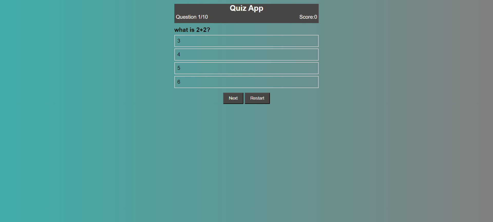
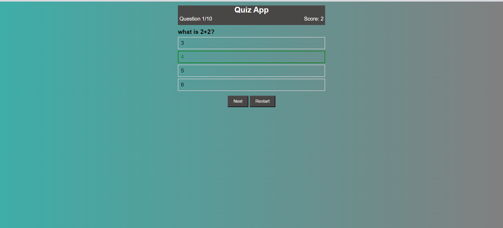
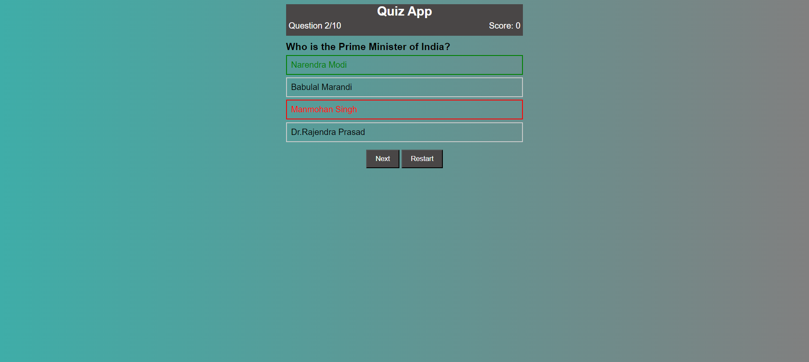
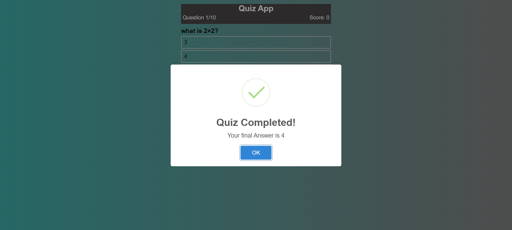
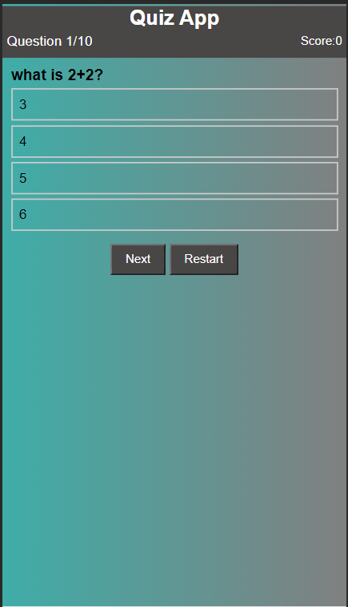
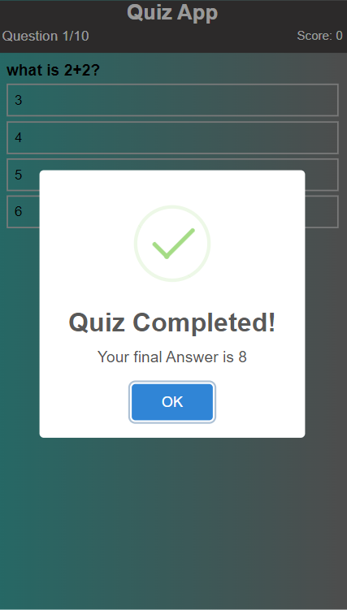

<!-- ## We created A Quiz-App-

```
We have added 10 question for testing purpose. and its fine for me.It is working As expected
You can also visit my Quiz-App.
```
## Tech Stack Used
```
- HTML5
- Css3
- Javascript
```
## Some Images of My Quiz-App





## For Mobile devices

 -->


# Quiz App

Welcome to the Quiz App, a dynamic web application designed to offer an engaging quiz experience. This project utilizes a combination of HTML5, CSS3, and JavaScript to create a seamless and interactive user interface.

## Features

- **User-Friendly Interface:** The Quiz App provides an intuitive and easy-to-navigate interface, ensuring a smooth experience for users of all levels.
  
- **Responsive Design:** Our app is designed to be responsive, adapting gracefully to different screen sizes. Whether you're on a desktop or a mobile device, you can enjoy the quiz seamlessly.

- **10 Challenging Questions:** Test your knowledge with our carefully crafted set of 10 questions. Each question is designed to be thought-provoking and fun.

## Screenshots

### Desktop View


### Mobile View


## Try it Live!

Check out the live version of the Quiz App [here](https://quiz-app-394i.vercel.app/).


## Getting Started

To experience the Quiz App:

1. Clone the repository: `git clone https://github.com/abhishekkumar085/Quiz-App.git`
2. Navigate to the project directory: `cd quiz-app`
3. Open the `index.html` file in your preferred web browser.

## Usage

Answer the quiz questions and see how many you can get right! Click through the interactive interface, and enjoy the challenge.

## Contributing

If you'd like to contribute to the development of this project, please follow our [Contribution Guidelines](CONTRIBUTING.md).

## License

This project is licensed under the MIT License - see the [LICENSE](LICENSE) file for details.

## Acknowledgements

- **Open Source Libraries:** We appreciate the contributions of various open-source libraries and tools that have enhanced the functionality of our Quiz App.

## Contact

For any inquiries, please contact [Abhishek Kumar] at [abhishekkumar08528@gmail.com].


